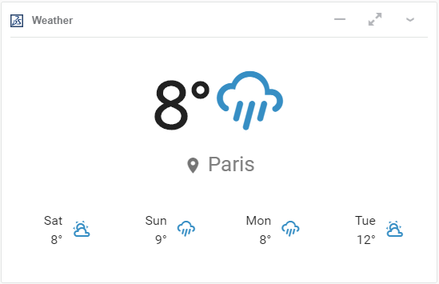

<!-- $PublishToSwym{"swym-data":"eyJzY2hlbWEiOiJBIiwiY29tbXVuaXRpZXMiOnsiX3lmeFQ5T0JTOFNkVW5RY3FqUXdXUSI6eyJtZWRpYXMiOnsiLi9XZWF0aGVyV2lkZ2V0LnBuZyI6IkxJSjRTY3dyVFltdnRIY2R0MFlQOUEifSwidHlwZSI6Indpa2kiLCJwYXJlbnRJZCI6IlRSdlJyenNxU1g2SmpuNjRsR2pTQ1EiLCJtZDUiOiI2YjEyMTE4YzYzNzkwM2MwOGE5ZTk1MmRjMzMyMzBlZCIsImlkIjoib0ppSmhmQ2lRUDJ1SlNyb2tNTTB4ZyJ9fX0="}$ -->

# Weather widget

This example shows how we can create a weather forecast in a widget.

It is based on the Vue widget template.

## 3DEXPERIENCE Administrator

If you are an 3DEXPERIENCE administrator and want to provide your users this widget in a dashboard, you will need to get a token from [Open Weather Map](https://home.openweathermap.org/).

## Let me try it now

1. Get a token from [Open Weather Map](https://home.openweathermap.org/)
2. Launch Weather widget in [Widget Lab Dashboard](https://eu1-215dsi0708-ifwe.3dexperience.3ds.com/#dashboard:c359a4a1-82d8-4f54-9539-c01bf64917a9/tab:Showcase/app:X3DRYAP_AP/content:moduleUrl=https%3A%2F%2Fbtcc.3ds.com%2Fwidget-lab%2Fwidget-weather%2Findex.html)
